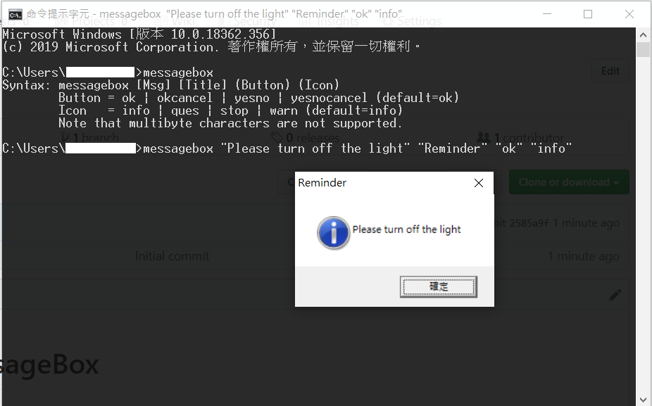

# Windows MessageBox for Cmd
A Cmd tool which utilizes the MessageBox WinAPI.

## Installation

1. Download the source code.
2. Compile the file with `g++ -o MessageBox.exe WinMessageBox.cpp`.
3. Place the program in somewhere like `C:\Users\<your name>\bin`, and then set up a `PATH` environment variable.
4. After that, you can run it simply via typing `messagebox` in `cmd.exe`!

*If you really do insist that you don't want to compile it by yourself, then [here](bin) is the binary. [HIGHLY UNRECOMMENDED]*

## Usage

The command line usage is as follows:

    Syntax: messagebox [Msg] [Title] (Button) (Icon)
            Button  =  ok | okcancel | yesno | yesnocancel (default=ok)
            Icon    =  info | ques | stop | warn (default=info)
            (Multi-byte characters are not supported)
    Return: 0 = fail, 1 = ok, 2 = cancel, 6 = yes, 7 = no.

You can further check in your script which button has been pressed.

For example, `if %errorlevel% == 1` can check if the OK button has been pressed instead of the CANCEL button.
